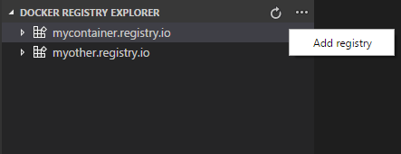
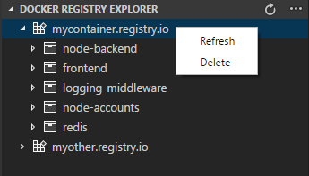
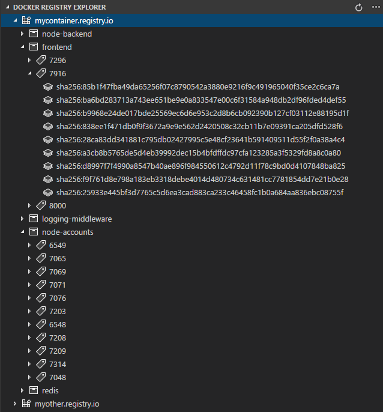
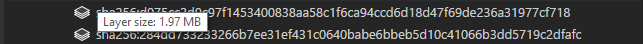
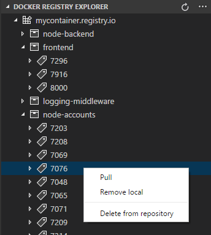

# Docker registry explorer

Explore and manage Docker Images, for private Docker Registries. 

## Features

### Add as many registries as you want

Add registry by providing url, user and password

### Perform actions on registry entry

Refresh registry node to load changes. Delete a registry entry from the explorer.

### List repositories/images, tags and layers

### Hover over to view image size or layer size

### Perform actions on image tags

- Pull image to local docker host
- Remove image from local docker host
- Delete image from remote repository (user needs to have write access to registry for this action)

## Requirements

No other requirements.

## Release Notes

- [Docker API V2](https://docs.docker.com/registry/spec/api/) based registries are supported only.
- For now only [Basic Authentication](https://swagger.io/docs/specification/authentication/basic-authentication/)  is supported.

### 0.0.1

Initial release.
